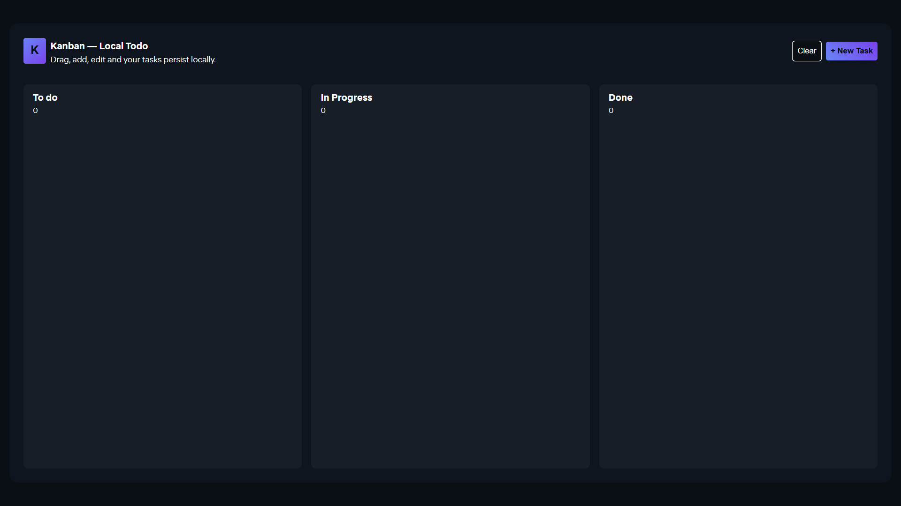
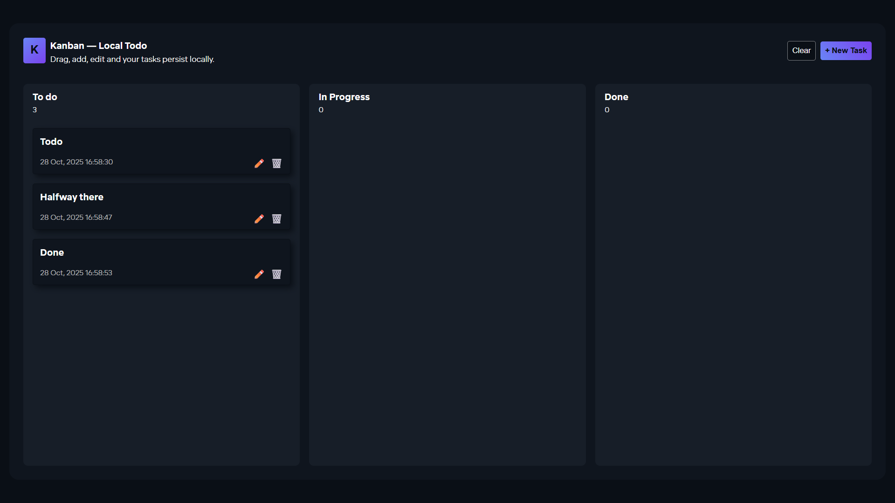
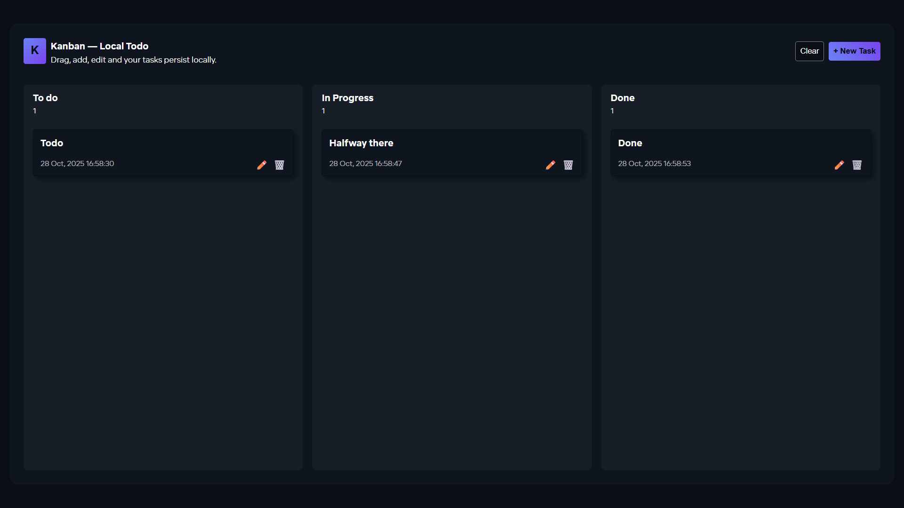

# Kanban - Todo Board

A fully interactive, drag-and-drop Kanban board built with vanilla HTML, CSS, and JavaScript. All tasks are saved to your browser's local storage, so your board persists between sessions.

## Features

- **Create, Read, Update & Delete (CRUD):** Full functionality to manage your tasks.
- **Drag & Drop:** Intuitively move tasks between "To Do", "In Progress", and "Done" columns.
- **Persistent Storage:** Uses `localStorage` to save your tasks, so they're waiting for you when you come back.
- **Responsive Design:** The layout is optimized for both desktop and mobile use.
- **Task Counters:** Each column shows a live count of the tasks it contains.

## How to Run

Simply open the `index.html` file in your web browser. No special setup is required.

## Technologies Used

- HTML5
- CSS3
- Vanilla JavaScript
